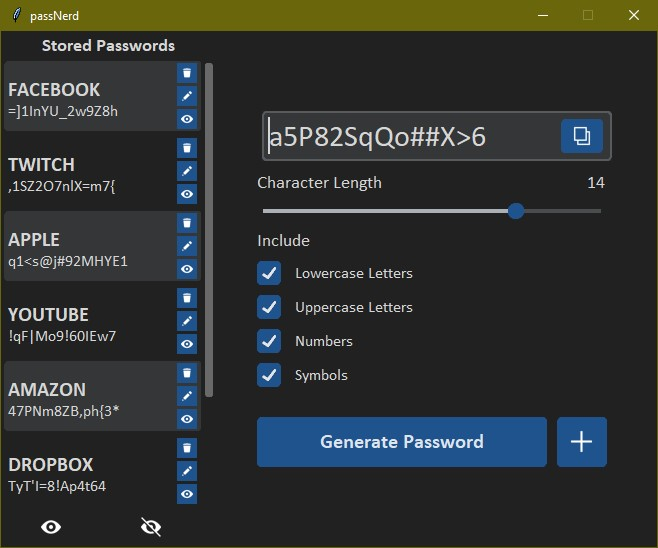

# 🔐 PassNerd – Password Generator + Manager

PassNerd is a sleek desktop GUI application that lets users generate secure, customizable passwords and store them alongside account labels for easy reference. Designed with usability and flexibility in mind, it features built-in password generation controls, secure storage interface, and a polished, responsive UI.



## Features

- **Secure Password Generation**
  - Customizable character length
  - Include/exclude: lowercase, uppercase, numbers, symbols
  - One-click copy to clipboard

- **Password Storage**
  - Label accounts (e.g. Facebook, Amazon, Dropbox)
  - Edit or view stored passwords
  - Toggle password visibility

- **Polished UI**
  - Built with `CustomTkinter` for a modern, dark-themed interface
  - Responsive layout and intuitive controls

- **Future Plans**
  - Encrypted password storage using hashing and/or encryption
  - Master password or keyfile support
  - Export/import saved passwords

## Tech Stack

- **Python**
- **CustomTkinter**
- **PIL (Pillow)**

## Getting Started

### Requirements
- Python 3.9+
- Install dependencies:
  ```bash
  pip install customtkinter pillow
